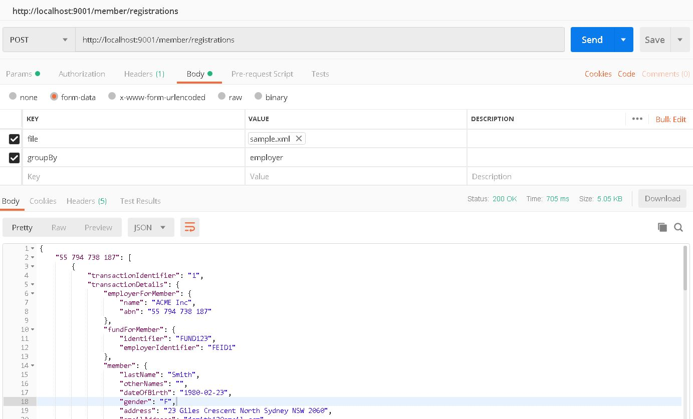

# SunCorpMemberRegistration
Member Registrations for Insurance company SuperChoice done by uploading input CSV or XML file.
The output shall be grouped by fund or Employer based on the input supplied.
The output can be downloaded to a File.

Use the sample.xml and sample.csv for Member Registrations, the code is tied to the format of the CSV

 GroupByFund Client

GroupByEmployer Client

